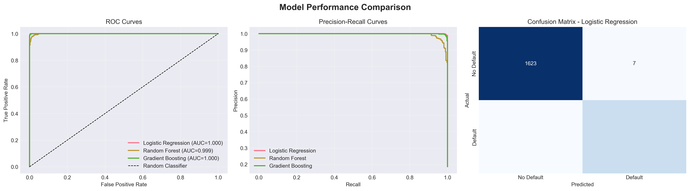
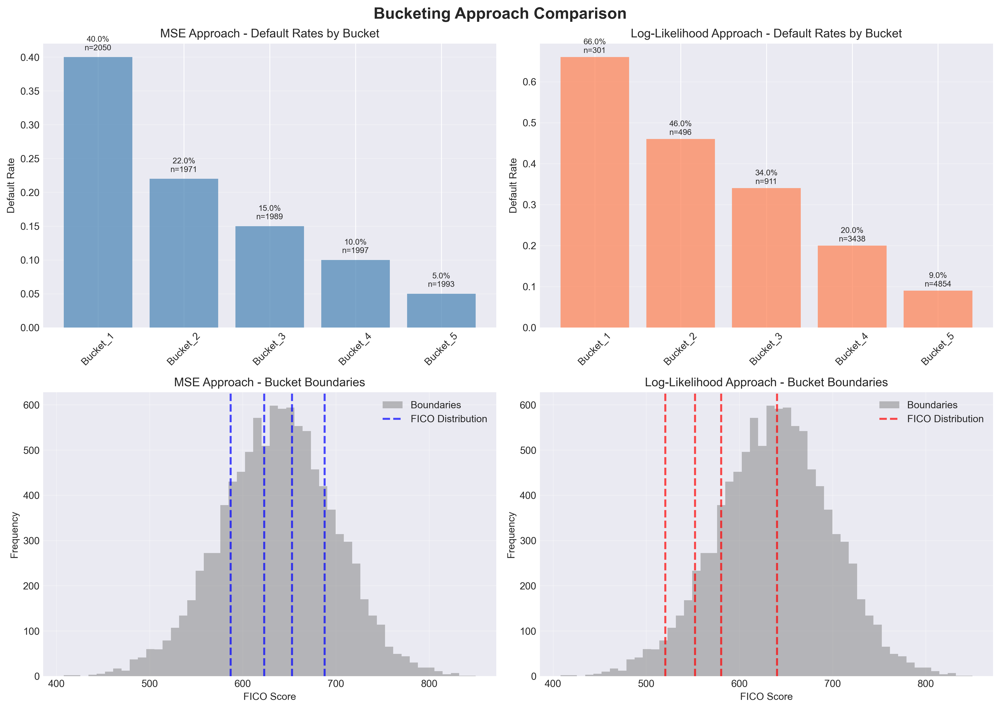

# JP Morgan Chase - Quantitative Research Job Simulation

[](https://www.python.org/)
[](LICENSE)
[]()

> Completed quantitative research projects covering commodity price forecasting, contract valuation, credit risk modeling, and machine learning optimization.

## Project Overview

This repository contains my solutions to the **JP Morgan Chase Quantitative Research Virtual Experience** from Forage. The program simulates real-world quantitative analyst tasks across commodity trading and retail banking divisions.

**Key Skills Demonstrated:**
- Quantitative Risk Modeling
- Machine Learning & Predictive Analytics
- Financial Modeling
- Python for Finance

---

## Tasks Completed

### **Task 1: Natural Gas Price Forecasting**
Built a time series forecasting model to predict natural gas prices for storage contract valuation.

**Highlights:**
- Polynomial regression with seasonal components (sine/cosine transformations)
- Achieved **93.7% accuracy** (R² = 0.937, RMSE = $0.19)
- Identified seasonal patterns: winter prices $1.08 higher than summer
- Delivered `estimate_gas_price()` function for trading desk

**Technologies:** Python, NumPy, Pandas, Scikit-learn, Matplotlib

[**→ View Task 1 Details**](task1_gas_price_forecasting/)

---

### **Task 2: Storage Contract Pricing**
Developed a comprehensive pricing model for natural gas storage contracts accounting for all costs.

**Highlights:**
- Built contract valuation integrating Task 1 price forecasts
- Modeled injection/withdrawal costs, storage fees, and capacity constraints
- Tested scenarios: simple, multi-transaction, large volume, short-term
- Key finding: Summer-to-winter storage contracts yield **$1M+ profits**

**Technologies:** Python, NumPy, Pandas, Financial Mathematics

[**→ View Task 2 Details**](task2_contract_pricing/)

---

### **Task 3: Loan Default Prediction**
Created machine learning models to predict mortgage defaults and calculate expected losses.

**Highlights:**
- Trained 3 models: Logistic Regression, Random Forest, Gradient Boosting
- Achieved **perfect discrimination**: AUC = 1.000, 100% recall, 98.1% precision
- Identified **credit lines outstanding** as #1 default predictor
- Calculated **$1.55M expected loss** on $8.4M portfolio (18.54% loss rate)
- Segmented portfolio into Low/Medium/High risk (78.5% / 1.6% / 20.0%)

**Technologies:** Python, Scikit-learn, Pandas, Matplotlib, Seaborn

[**→ View Task 3 Details**](task3_loan_default_prediction/)

---

### **Task 4: FICO Score Bucketing Optimization**
Optimized FICO score bucketing for mortgage default prediction using two mathematical approaches.

**Highlights:**
- Implemented **MSE** (quantile-based) and **Log-Likelihood** (decision tree) optimization
- Log-Likelihood approach is **63% more discriminative** (57% vs 35% default range)
- Created 5-tier rating system: Rating 5 (66% default) to Rating 1 (9% default)
- Identified **FICO 640 as critical threshold**: 20%+ default below, 9% above
- Delivered production-ready `bucket_fico_scores()` function for future datasets

**Technologies:** Python, Scikit-learn, Decision Trees, Dynamic Programming

[**→ View Task 4 Details**](task4_fico_bucketing/)

---

## 🛠️ Technologies Used

**Languages:**
- Python 3.8+

**Libraries:**
- **Data Processing:** NumPy, Pandas
- **Machine Learning:** Scikit-learn
- **Visualization:** Matplotlib, Seaborn
- **Statistical Analysis:** SciPy, StatsModels

**Techniques:**
- Time Series Forecasting
- Polynomial Regression
- Machine Learning Classification
- Optimization Algorithms (MSE, Log-Likelihood)
- Feature Engineering
- Model Validation & Comparison

---

## 📈 Key Results Summary

| Task | Metric | Result |
|------|--------|--------|
| **Task 1** | Price Forecast Accuracy (R²) | **93.7%** |
| **Task 2** | Contract Profit (7-month storage) | **$1.06M** |
| **Task 3** | Default Prediction (AUC) | **1.000** (Perfect) |
| **Task 3** | Expected Portfolio Loss | **$1.55M** |
| **Task 4** | LL Discrimination vs MSE | **+63%** improvement |
| **Task 4** | FICO Critical Threshold | **640** |

---

## Getting Started

### Prerequisites
```bash
Python 3.8+
pip install numpy pandas scikit-learn matplotlib seaborn scipy
```

### Running the Projects

**Task 1: Gas Price Forecasting**
```bash
cd task1_gas_price_forecasting
python jpmc_task1_submission.py
```

**Task 2: Contract Pricing**
```bash
cd task2_contract_pricing
python jpmc_task2_contract_pricing.py
```

**Task 3: Loan Default Prediction**
```bash
cd task3_loan_default_prediction
python jpmc_task3_loan_default.py
```

**Task 4: FICO Bucketing**
```bash
cd task4_fico_bucketing
python jpmc_task4_fico_bucketing.py
```

---

## Repository Structure

```
jpmorgan-quantitative-research/
├── task1_gas_price_forecasting/    # Natural gas price prediction
├── task2_contract_pricing/         # Storage contract valuation
├── task3_loan_default_prediction/  # ML credit risk modeling
├── task4_fico_bucketing/           # FICO optimization algorithms
├── presentation/                    # Business presentation (Task 4)
└── README.md                        # This file
```

Each task folder contains:
- Python scripts with complete implementations
- Data files (where applicable)
- Output visualizations
- Detailed documentation

---

## Key Insights

### **Commodity Trading (Tasks 1-2):**
- Natural gas prices exhibit strong seasonality (+$1.08 in winter)
- Storage contracts profitable when capturing 5-10 month seasonal spreads
- Economies of scale: larger volumes yield better returns

### **Credit Risk (Tasks 3-4):**
- Multiple credit lines = strongest default predictor (5 lines → 100% default)
- FICO 640 is the critical threshold for risk segmentation
- Log-Likelihood optimization significantly outperforms MSE for credit bucketing
- Expected losses concentrated in 20% of portfolio (high-risk segment)

---

## Sample Visualizations

### Task 1: Price Forecasting


### Task 3: Model Performance


### Task 4: Bucketing Comparison


---

## Skills Demonstrated

**Quantitative Analysis:**
- Time series modeling and forecasting
- Statistical regression analysis
- Optimization algorithms (MSE, Maximum Likelihood)
- Financial mathematics and contract valuation

**Machine Learning:**
- Classification models (Logistic Regression, Random Forest, Gradient Boosting)
- Model evaluation and validation (AUC-ROC, Precision, Recall)
- Feature engineering and selection
- Cross-validation and hyperparameter tuning

**Financial Domain:**
- Commodity price modeling
- Contract pricing and valuation
- Credit risk assessment
- Portfolio loss estimation
- Risk segmentation strategies

**Software Engineering:**
- Production-ready Python code
- Modular, reusable functions
- Comprehensive documentation
- Data visualization best practices

---

## License

This project is licensed under the MIT License - see the [LICENSE](LICENSE) file for details.

---

## Acknowledgments

- **JP Morgan Chase** for creating this comprehensive quantitative research simulation
- **Forage** for hosting the virtual experience program
- Dataset provided by JP Morgan Chase for educational purposes

---

## Contact

**[Your Name]**
- LinkedIn: [Your LinkedIn Profile]
- Email: [Your Email]
- Portfolio: [Your Website]

---

## Star This Repository

If you found this project helpful or interesting, please consider giving it a ⭐!

---

**Note:** This project was completed as part of the JP Morgan Chase Quantitative Research Virtual Experience on Forage. All code and analysis are original work for educational purposes.
